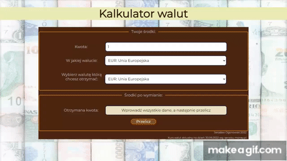

# Currency calculator
## Demo: 
https://jaroslawogonowski.github.io/currency-calculator/

### The website presents the use of:
- forms and their validation, 
- BEM conventions, 
- basic js functions,
- ES6 (features: let, const, arrow functions)



I also carried out full js refactoring.
This is my first very complex code:
Version 1 - raw
```console.log("HelloBigBrain!");
let startSum = document.querySelector(".js-startSum");
let yourCurrency = document.querySelector(".js-yourCurrency");
let exchangedCurrency = document.querySelector(".js-exchangedCurrency");
let exchangeRate = document.querySelector(".js-exchangeRate");
let receivedAmount = document.querySelector(".js-receivedAmount");
let receivedAmountCurrency = document.querySelector(".js-receivedAmountCurrency");
let button = document.querySelector(".form__button")
let form = document.querySelector(".js-form")

form.addEventListener("submit", (event) => {
    event.preventDefault();
})

exchangedCurrency.addEventListener("input", () => {
    switch (exchangedCurrency.value) {
        case "exchangedPLN":
            receivedAmountCurrency.innerText = "PLN";
            break;
        case "exchangedEUR":
            receivedAmountCurrency.innerText = "EUR";
            break;
        case "exchangedUSD":
            receivedAmountCurrency.innerText = "USD";
            break;
        case "exchangedGBP":
            receivedAmountCurrency.innerText = "GBP";
            break;
    }
});

form.addEventListener("input", () => {
    if (exchangedCurrency.value === "exchangedPLN" && yourCurrency.value === "USD") {
        exchangeRate.value = "4.71";
    } else if (exchangedCurrency.value === "exchangedEUR" && yourCurrency.value === "USD") {
        exchangeRate.value = "0.99";
    }
    else if (exchangedCurrency.value === "exchangedUSD" && yourCurrency.value === "USD") {
        exchangeRate.value = "1.00";
    }
    else if (exchangedCurrency.value === "exchangedGBP" && yourCurrency.value === "USD") {
        exchangeRate.value = "0.85";
    }
    else if (exchangedCurrency.value === "exchangedUSD" && yourCurrency.value === "USD") {
        exchangeRate.value = "1.00";
    }
    else if (exchangedCurrency.value === "exchangedUSD" && yourCurrency.value === "EUR") {
        exchangeRate.value = "1.01";
    } else if (exchangedCurrency.value === "exchangedUSD" && yourCurrency.value === "PLN") {
        exchangeRate.value = "0.21";
    }
    else if (exchangedCurrency.value === "exchangedUSD" && yourCurrency.value === "GBP") {
        exchangeRate.value = "1.15";
    }
    else if (exchangedCurrency.value === "exchangedEUR" && yourCurrency.value === "PLN") {
        exchangeRate.value = "0.21";
    }
    else if (exchangedCurrency.value === "exchangedUSD" && yourCurrency.value === "PLN") {
        exchangeRate.value = "0.21";
    }
    else if (exchangedCurrency.value === "exchangedGBP" && yourCurrency.value === "PLN") {
        exchangeRate.value = "0.18";
    }
    else if (exchangedCurrency.value === "exchangedPLN" && yourCurrency.value === "PLN") {
        exchangeRate.value = "1.00";
    }
    else if (exchangedCurrency.value === "exchangedPLN" && yourCurrency.value === "EUR") {
        exchangeRate.value = "4.66";
    }
    else if (exchangedCurrency.value === "exchangedPLN" && yourCurrency.value === "GBP") {
        exchangeRate.value = "5.38";
    }
    else if (exchangedCurrency.value === "exchangedEUR" && yourCurrency.value === "EUR") {
        exchangeRate.value = "1.00";
    }
    else if (exchangedCurrency.value === "exchangedUSD" && yourCurrency.value === "EUR") {
        exchangeRate.value = "0.99";
    }
    else if (exchangedCurrency.value === "exchangedGBP" && yourCurrency.value === "EUR") {
        exchangeRate.value = "0.86";
    }

    else if (exchangedCurrency.value === "exchangedEUR" && yourCurrency.value === "GBP") {
        exchangeRate.value = "1.14";
    }
    else if (exchangedCurrency.value === "exchangedGBP" && yourCurrency.value === "GBP") {
        exchangeRate.value = "1.00";
    }
})

button.addEventListener("click", () => {
    let result = startSum.value * exchangeRate.value
    receivedAmount.value = result.toFixed(2)
})

form.addEventListener("input", () => {
    receivedAmount.value = "Wprowadź wszystkie dane, a następnie przelicz";
    
```

version 2 - when i learned template literals and js function
```
{
    let baseCurrencyResult;
    const welcome = () => { console.log("HelloBigBrain!"); }

    const formValidation = () => {
        const form = document.querySelector(".js-form");
        const receivedAmount = document.querySelector(".js-receivedAmount");
        form.addEventListener("input", () => {
            receivedAmount.value = "Wprowadź wszystkie dane, a następnie przelicz";
        })
        form.addEventListener("submit", (event) => {
            event.preventDefault();
        })
    }
    const baseCurrency = () => {
        const yourCurrency = document.querySelector(".js-yourCurrency");
        const startSum = document.querySelector(".js-startSum");
        const button = document.querySelector(".form__button");
        button.addEventListener("click", () => {
            switch (yourCurrency.value) {
                case "PLN":
                    return baseCurrencyResult = +startSum.value;
                case "EUR":
                    return baseCurrencyResult = +startSum.value * 4.8698;
                case "USD":
                    return baseCurrencyResult = +startSum.value * 4.9533;
                case "GBP":
                    return baseCurrencyResult = +startSum.value * 5.556;
            }
        })
    }
    exchangedMoney = () => {
        const exchangedCurrency = document.querySelector(".js-exchangedCurrency");
        let receivedAmount = document.querySelector(".js-receivedAmount");
        const button = document.querySelector(".form__button");
        const yourCurrency = document.querySelector(".js-yourCurrency");
        const startSum = document.querySelector(".js-startSum");
        
        const plnChange = () => {
            button.addEventListener("click", () => {
                if (exchangedCurrency.value === "exchangedPLN")
                    return receivedAmount.value = `${baseCurrencyResult.toFixed(2)}` + " PLN";
            })
        }

        const euroChange = () => {
            button.addEventListener("click", () => {
                if (exchangedCurrency.value === "exchangedEUR" && yourCurrency.value === "EUR")
                    return receivedAmount.value = startSum.value + " EUR";
                else if (exchangedCurrency.value === "exchangedEUR" && yourCurrency.value !== "EUR")
                    return receivedAmount.value = (+baseCurrencyResult * 0.2053).toFixed(2) + " EUR";
            })
        }
        const usdChange = () => {
            button.addEventListener("click", () => {
                if (exchangedCurrency.value === "exchangedUSD" && yourCurrency.value === "USD")
                    return receivedAmount.value = startSum.value + " USD";
                else if (exchangedCurrency.value === "exchangedUSD" && yourCurrency.value !== "USD")
                    return receivedAmount.value = (+baseCurrencyResult * 0.2019).toFixed(2) + " USD";
            })
        }
        const gbpChange = () => {
            button.addEventListener("click", () => {
                if (exchangedCurrency.value === "exchangedGBP" && yourCurrency.value === "GBP")
                    return receivedAmount.value = startSum.value + " GBP";
                else if (exchangedCurrency.value === "exchangedGBP" && yourCurrency.value !== "GBP")
                    return receivedAmount.value = (+baseCurrencyResult * 0.18).toFixed(2) + " GBP";
            }
            )
        }
        initialChange = () => {
            gbpChange();
            usdChange();
            euroChange();
            plnChange();
        }
    }

    welcome();
    formValidation();
    baseCurrency();
    exchangedMoney();
    initialChange();
}
```

Now it's shorter, tidy and legible.
It is also based on completely different assumptions than originally.


## Made by: Jarosław Ogonowski 2022